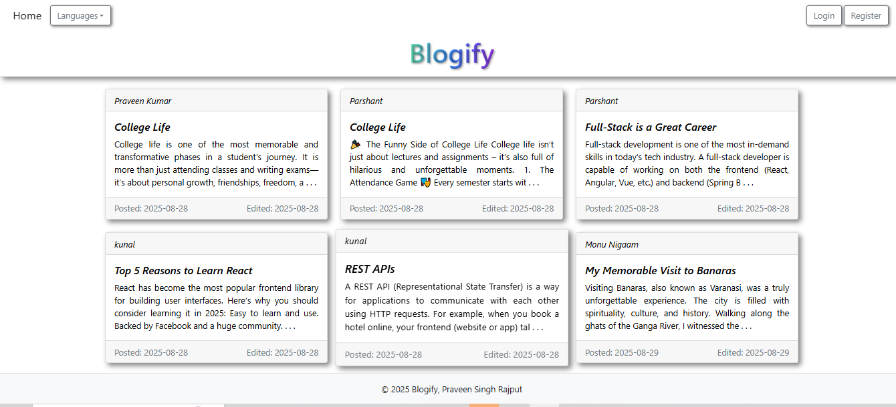

# Blogify - Full-Stack Blogging Platform

## Overview
Blogify is a full-stack web application designed to provide users with a platform to create, manage, and share blog posts. The application is developed using **React** for the frontend and **Spring Boot** for the backend, with **MySQL** as the database. It demonstrates practical knowledge of full-stack development, including RESTful API design, authentication, and responsive UI development.

## Objectives
- To enable users to create, edit, and delete blog posts securely.
- To implement user authentication and authorization with role-based access.
- To provide a responsive and user-friendly interface for managing blogs.
- To showcase integration between frontend and backend technologies in a real-world scenario.

## Features
- **User Management:** Registration, login, and role-based access (Admin/User).
- **Blog Operations:** Create, edit, delete, and view blog posts.
- **Secure Communication:** Authentication using JWT tokens and Spring Security.
- **Data Management:** Persistent storage of user and blog data in MySQL.
- **Responsive Design:** Frontend built with React, supporting both desktop and mobile devices.

## Technologies Used
- **Frontend:** React, Tailwind CSS, React-Hook-Form
- **Backend:** Java, Spring Boot, Spring Security, JWT
- **Database:** MySQL
- **Development Tools:** Postman, Maven, Git

## System Architecture
The application follows a **client-server architecture**:
1. **Frontend (Client):** Handles user interactions and communicates with the backend through REST APIs.
2. **Backend (Server):** Processes requests, handles business logic, and interacts with the database.
3. **Database:** Stores persistent data, including user accounts, roles, and blog content.

## Use Case
- A registered user can log in and create personal blogs.
- An admin can manage all users and blogs.
- Users can view blogs posted by others and perform search operations.
- The system ensures data integrity and secure access using authentication and role management.

## Significance
This project serves as a practical example of modern full-stack development. It demonstrates:
- Integration of frontend and backend frameworks.
- Implementation of security features in web applications.
- Efficient data handling using relational databases.
- Design of user-friendly and responsive interfaces.

## Conclusion
Blogify provides a secure, interactive, and user-centric blogging platform. It is suitable for learning full-stack development concepts, understanding web application architecture, and exploring modern technologies like React and Spring Boot in practice.

---

**Author:** Praveen Kumar  
**Course/Program:** Full-Stack Web Development Project
